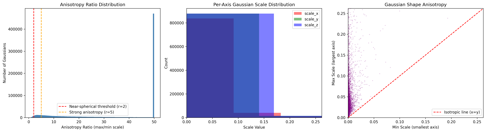

# 3D Gaussian Splatting — Custom Dataset Implementation

## Acknowledgements
This project uses the 3DGS implementation by Kerbl et al. (2023).
Original code: [graphdeco-inria/gaussian-splatting](https://github.com/graphdeco-inria/gaussian-splatting)

> All original code is unmodified. My contributions are in `report/`, `results/`, and `notebooks/`.

---

## Assignment Overview

Implementation of 3D Gaussian Splatting (Kerbl et al., 2023) on a custom 141-image
photographic dataset, with analysis of anisotropic correlation in the learned Gaussian primitives.

---

## Repository Structure

| Folder | Contents |
|---|---|
| `report/` | Full analysis report with equations and findings |
| `results/` | Trained model (.ply) and anisotropy analysis charts |
| `notebooks/` | Complete Colab pipeline (.py file) |
| `dataset/` | Dataset description and Google Drive link |

---

## Results

| Parameter | Value |
|---|---|
| Training iterations | 30,000 |
| Initial sparse points | 52,363 |
| Resolution scale | 4 (quarter) |
| PSNR at iteration 7,000 | 21.91 dB |
| Loss at iteration 7,000 | 0.1201 |

---

## Anisotropy Analysis

See [report/report.md](report/report.md) for the full written analysis.

---

## How to View the 3D Model

1. Download `results/point_cloud.ply`
2. Go to [playcanvas.com/supersplat/editor](https://playcanvas.com/supersplat/editor)
3. Drag and drop the `.ply` file into the browser

---

## How to Run

1. Open [Google Colab](https://colab.research.google.com)
2. Upload `notebooks/Gaussian_splatting_implemetation.py`
3. Set runtime to **T4 GPU**
4. Run all cells in order

---

## Dataset

141 custom photographs processed with COLMAP Structure-from-Motion.
Full dataset: [Google Drive Link](https://drive.google.com/drive/folders/1aeOwgc9S31oKLpVuHZl63UvRaxqi7_dD?usp=drive_link)

---

## References

Kerbl, B., Kopanas, G., Leimkühler, T., & Drettakis, G. (2023).
*3D Gaussian Splatting for Real-Time Radiance Field Rendering.*
ACM Transactions on Graphics, 42(4). https://arxiv.org/abs/2308.04079
